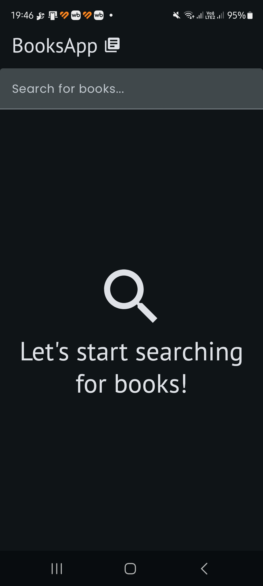
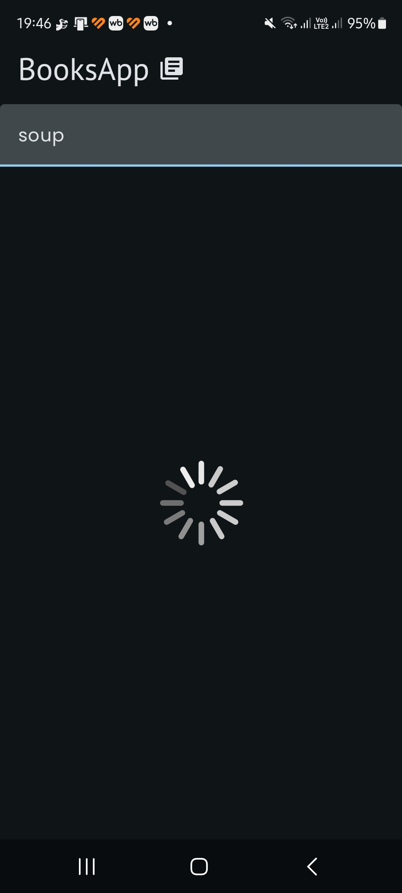
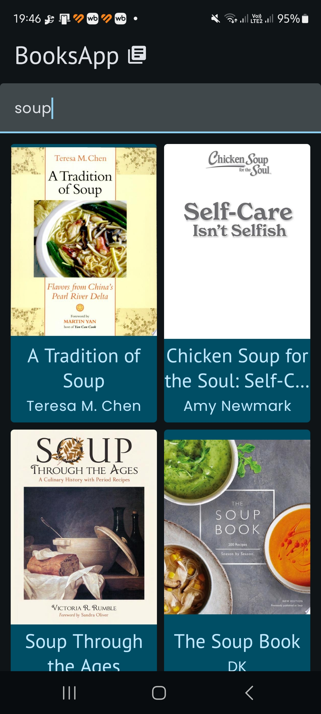
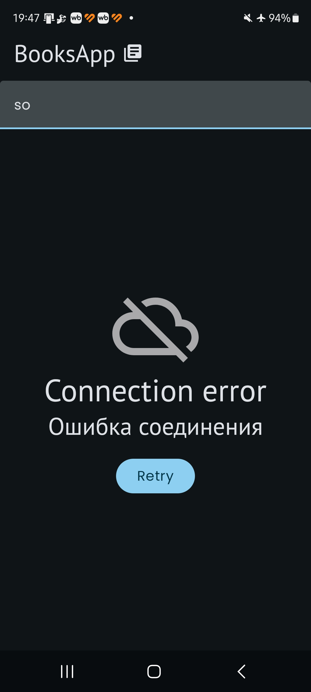

# Books App

Учебное приложение для поиска книг.
Позволяет отправлять запросы к Google Books API и получать ответы, преобразованные в карточки книг.
Из карточки книги можно перейти на страницу этой книги на Google Books.
Сделано с целью отработки полученных навыков в ходе Pathway 5 курса Android Basics With Compose.
На данный момент отображаются только первые 10 результатов поиска.

## Функциональность
- Поиск книг через Google Books API
- Отображение результатов в виде карточек
- Переход на страницу книги в Google Books
- Асинхронная загрузка обложек книг
- Обработка ошибок HTTP и подключения к сети

## Технологии
- Kotlin
- Jetpack Compose
- Material Design 3
- MVVM архитектура
- Coroutines + Flow
- Retrofit + OkHttp
- Coil для загрузки изображений
- Dependency Injection

## Скриншоты

  
  
  

  
  
  

## Запуск
1. Откройте проект в Android Studio
2. Получите API ключ на [Google Cloud Console](https://console.cloud.google.com/)
3. Включите Books API в проекте
4. Добавьте в local.properties: API_KEY=your_key
5. Запустите проект
